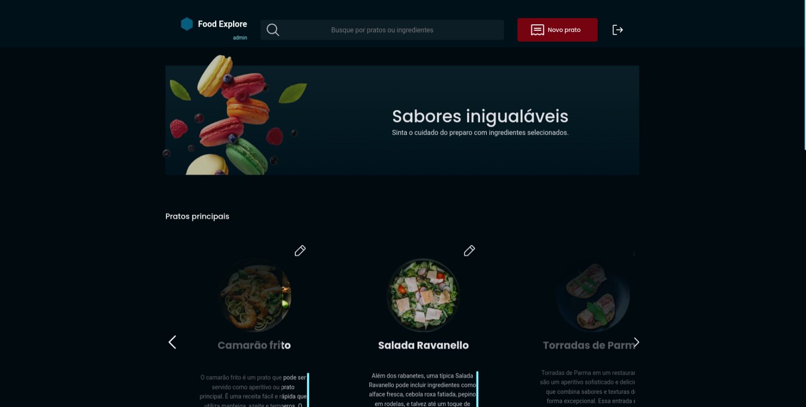
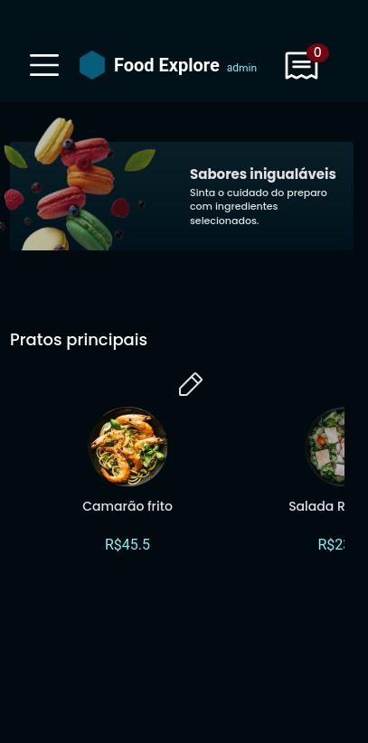

# Explore Food

Esse é o projeto de final da trilha Explore, a ideia é um restaurante fictício, consolidando todo aprendizado fullstack.

## Tecnologia

**Front-end:** React, Styled-Components

**Back-end:** Node, Express, Knex

## Conceitos

- Estrutura MVC
- Rotas e protocolo https
- Knex e sqlite3
- Moblie first
    - Responsividade
    - Animação simples
- Factory pattens
- Componentes
- bcryptjs
    - criptografia
- Autenticação
    - JWT
- Middlewere
    - Multer (upload de imagem)

## Acesso

admin: 
   - Email: remy5estrela@gmail.com
   - senha: ratatouille
## Demonstração

- Desktop:
  

- Mobile: 

   
